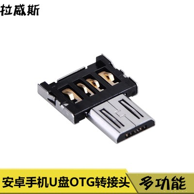

# LG Gram 15Z980 for macOS Mojave

## 配置信息

| 规格     | 详细信息                      |
| -------- | ----------------------------- |
| 电脑型号 | LG Gram 15Z980-G.AA52C        |
| 处理器   | Core i5-8250U                 |
| 内存     | 8GB + 8G金士顿DDR4 2400MHz    |
| 硬盘     | Intel 760P 512GB SSD          |
| 显卡     | UHD Graphics 620              |
| 显示器   | 15.6寸 LG LGD05A8 (1920x1080) |
| 声卡     | Conexant CX8200               |
| 无线网卡 | Broadcom 943602CS             |

## 完成度

- [x] 显卡：正常，hdmi输出正常（ig-platform-id：00001659）
- [x] WIFI：通过m-key转接板插在右边m.2插槽，免驱，AirDrop可用
- [x] 蓝牙：d+/d-线接到外置usb接口，免驱
- [x] 声卡：正常，hdmi、耳机输出正常，siri耳背（layout-id：21）
- [x] 睡眠唤醒：正常，唤醒正常
- [x] 键盘：正常
- [x] 电量显示：正常
- [x] 摄像头：正常
- [ ] 触摸板：型号太小众，未能驱动，后续考虑采用蓝牙触摸板代替
- [ ] 指纹：禁用了
- [ ] 读卡器：没管它

## HIDPI

通过脚本开启hidpi，测试发现分辨率1600x800有轻微雪花，低于1472x828才完全不会出现雪花，用处不大

```bash
$ sh one-key-hidpi/one-key-hidpi.sh
```

## 关于蓝牙

蓝牙需要连到usb，采取的方案是从usb母座走线，焊接到otg转接头（如下图）的d+/d-，然后转接头的Micro USB这端折断。并插入的usb接口



该方案的好处是不会焊到主板上，外观上基本上看不出，坏处就是要占用一个外置usb接口，不过还有2个usb接口，正常使用应该够了
